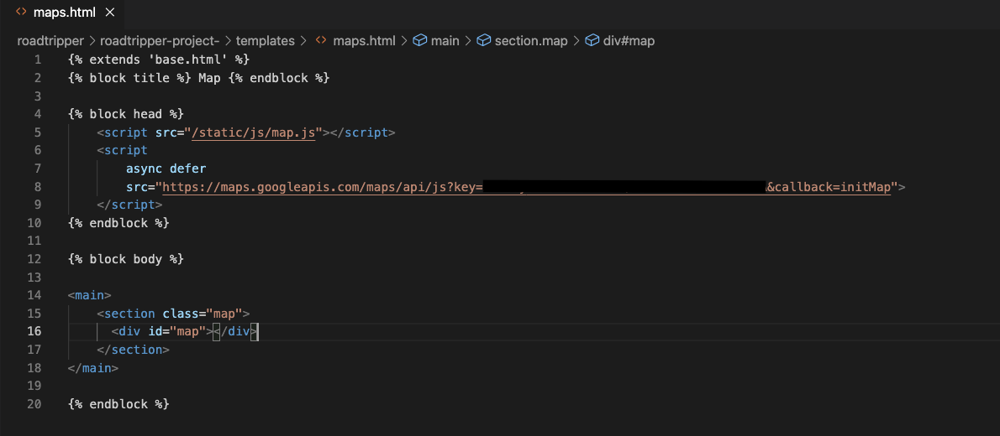

# RoadTripper

RoadTripper is an app for the hike enthustist. This app will let the user can search and save hikes in National Parks to their user profile. 

## Technologies Used

- Python 
- JavaScript 
- Flask
- SQLAlchemy 
- PostgreSQL
- HTML
- CSS
- Bootstrap 
- JQuery
- AJAX
- Jinja

## API Used 
- Google Maps JavaScript API

## Dataset Used
- AllTrails : Every trail in National Park Service gathered from AllTrails
    - *https://www.kaggle.com/planejane/national-park-trails*

## How to install

- The Google Maps JavaScript API Key for this project is restricted by IP address. To run this program you will need to sign up for Google Maps API.
    - Go to *https://console.cloud.google.com/apis/dashboard?project=flash-datum-329421* and then navigate to the API Dashboard
    - Set up account 
    - Google will create default project for you called *My First Project*
    - On APIs Dashboard page, click *Enable APIs and Services*
    - Search for *Maps JavaScript API* and enable it
    - Once enabled, get your API key 
    - Go to your credentials page, click on create credentials *API key*
    - When you get your API key, you will need to restrict it by clicking *Restrict Key*
        - Find section called *Application Restrictions*
        - Choose to restrict by *IP Addresses*
        - Put your IP address into section *Accept requests from these server IP addresses*
        - Find *API Restrictions* section
        - Choose *Restricct Key* *Maps JavaScript API*
    - Insert your API key where the black line is in image below into the script in *maps.html*
        
    - Save *maps.html* file
 
- Copy link from GitHub repository
- In VS code use command *git* *clone* *https://github.com/gmgressard/roadtripper-project-.git*
- Create virtual environment using commands:  
    - *virtualenv* *env*
    - *source* *env/bin/activate*
    - *pip3* *install* *-r* *requirements*
- Run *python3* *server.py*
- Open browser: http://localhost:5000/

## How to use 

- User can look at *favorite* *hikes* or *find* *new* *hike* from their homepage

    

- Filter by state

    

- Filter by national park 

    

- Favorite a hike you want to do 

    

