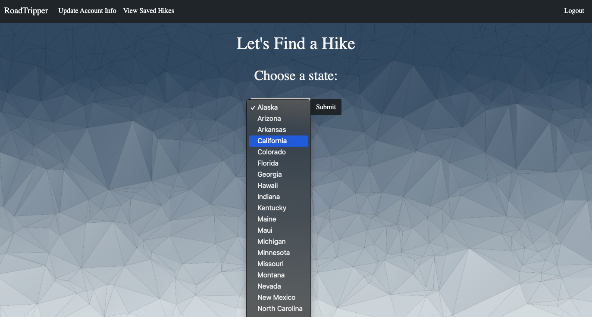

# RoadTripper

RoadTripper is an app for the hike enthustist. This app will let the user can search and save hikes in National Parks to their user profile. 

## Technolgies Used

- Python
- JavaScript
- HTML
- CSS
- JQuery
- AJAX

## How to install

- Copy link from GitHub repository
- In VS code use command *git* *clone* *https://github.com/gmgressard/roadtripper-project-.git*
- Create virtual environment using commands:  
    - *virtualenv* *env*
    - *source* *env/bin/activate*
    - *pip3* *install* *-r* *requirements*
- Run *python3* *server.py*
- Open browser: http://localhost:5000/

## How to use 

- User can look at *favorite* *hikes* or *find* *new* *hike* from their homepage

    

- Filter by state

    

- Filter by national park 

    

- Favorite a hike you want to do 

    